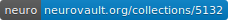

# Volume-wise analysis of fMRI time series allows accurate prediction of language lateralization

[](https://doi.org/10.1101/725671)
[](https://identifiers.org/neurovault.collection:5132)
[](https://dx.doi.org/10.18112/openneuro.ds002014.v1.0.1) 

Martin Wegrzyn, Markus Mertens, Christian G. Bien, Friedrich G. Woermann & Kirsten Labudda

### Abstract

Using fMRI as a clinical tool, for example for lateralizing language, requires that it provides accurate results on the individual level. However, using one activity map per patient limits how well the uncertainty associated with a decision can be estimated. Here, we explored how using a „volume-wise“ analysis, where the lateralization of each time point of a patient's fMRI session is evaluated independently, could support clinical decision making.  
Ninety-six patients with epilepsy who performed a language fMRI and a Wada test were analyzed retrospectively. Each patient’s 200 fMRI volumes were correlated with a template of prototypical lateralization. Depending on the strength of correlation with the template, each volume was classified as indicating either left-lateralized, bilateral or right-lateralized language. A decision about the patient’s language lateralization was then made based on a majority vote.  
Accuracies of 84% were reached in a sample of 63 patients with high-quality data. When 33 patients with datasets previously deemed inconclusive were added, the same accuracy was reached when more than 43% of a patient’s volumes were in agreement with each other. Increasing this cutoff to 51% volumes with agreeing classifications allowed for excluding all inconclusive cases and reaching accuracies over 90% for the remaining cases.  
The study confirms the usefulness of fMRI for language lateralization. Furthermore, it illustrates how the diagnostic yield of fMRI data can be increased using simple similarity measures. The accuracy of our approach increased with the number of agreeing volumes, and thus allowed estimating the uncertainty associated with each individual diagnosis.  

#### Graphical Abstract of Methods


#### Notebooks with full analysis code

[overview notebook on nbviewer](https://nbviewer.jupyter.org/github/mwegrzyn/volume-wise-language/blob/master/notebooks/00-mw-overview-notebook.ipynb)

### Project Organization

```
├── README.md           <- The top-level README for developers using this project.
│
├── LICENSE             <- Code is distributed under the MIT License.
│
├── Makefile            <- Tranforms notebooks into .py files for module use and downloads example data
│
├── data                Note: Patient Data are not publicly available
│   ├── external        <- Data from third party sources (e.g. MNI templates).
│   ├── raw             <- The original, immutable data.
│   ├── interim         <- Intermediate data that has been transformed.
│   └── processed       <- The final features and predictions.
│
├── notebooks           <- Jupyter notebooks. Naming convention is a number (for ordering),
│                          the creator's initials, and a short `-` delimited description, e.g.
│                          `01-mw-train-test-split`.
│
├── models              <- Transformations applied to training data
│                          and predictive models derived from training.
│
├── reports             <- Final results of the analyses.
│   └── figures         <- Generated figures used in the manuscript and this readme.
│   └── nii             <- fMRI group results in normalized MNI space.
│
├── ms                  <- The preprint of the article as a LaTeX document.
│
├── helper              <- Scripts which help to convert notebooks into .py files, etc.
│
├── temp                <- Data which are only needed temporarily are stored here.
│
├── src                 <- Notebooks converted to a Python module (make python_module).
│   │
│   ├── __init__.py     <- Makes src a Python module.
│   │
│   ├── make_predict.py <- Allows to run a complete analysis for one dataset.
│   │
│   ├── data            <- Scripts to generate interim data.
│   │   ├── make_dataset_z_orig.py <- make z-transformed voxel-wise timecourses
│   │   ├── make_dataset_z_diff.py <- get left-right difference for each voxel
│   │   └── external               <- canonical templates and maskers needed
│   │
│   ├── features        <- Scripts to turn interim data into features for modeling.
│   │   └── build_features.py
│   │
│   ├── models          <- Scripts to use trained models to make predictions,
│   │   │                  as well as pickled objects which contain the models
│   │   └── predict_model.py
│   │
│   └── visualization   <- Scripts to create result visualizations.
│       ├── visualize_time.py      <- timecourse plots (200 volumes and one cycle)
│       ├── visualize_log.py       <- logistic function plot
│       ├── visualize_counts.py    <- space and doughnut plot
│       └── visualize_all.py       <- wrap all plots into one big figure
│
│
├── examples            <- example data (one healthy control participant not part of the study;
│                          these data can be grabbed from figshare using the make example_data
│                          function from the Makefile)
│                          and outputs of running the toolbox on that participant
│
├── requirements.txt    <- The requirements file for reproducing the analysis environment,
│                          generated with `conda list -e > requirements.txt`
│
└── env                 <- The analysis environment, generated with
                           `conda create --name env --file requirements.txt`
```
<p><small>Project structure based on the <a target="_blank" href="https://drivendata.github.io/cookiecutter-data-science/">cookiecutter data science project template</a>. #cookiecutterdatascience</small></p>

### Example Data

You can download an example dataset by typing  

  ```shell
  make example_data
  ```

These data can then be analyzed using the src module as follows  

  ```python
  import src as vol
  vol.make_predict('./examples/','patientID')
  ```

### Requirements

Data analysis was performed on Debian 8.11 with Python 3.6 using mainly numpy, scipy, pandas, scikit-learn, nilearn, matplotlib, seaborn and jupyter.  

To run all the scipts, you can create a virtual environment, by first installing miniconda.  

Then you can create a virtual environment in the folder into which you cloned this repository and install all modules using pip and the requirements file provided in this repository  

  ```shell
  conda create --name env --file requirements.txt
  ```

Alternatively, install new versions of all requirements like this:  

  ```shell
  conda install -c conda-forge numpy scipy matplotlib seaborn scikit-learn pandas nilearn jupyter pysurfer cookiecutter jupyter_contrib_nbextensions jupyter_nbextensions_configurator
  ```

You can start the environment like this:  

  ```shell
  conda activate env
  ```

### Contact

For questions or comments please write to [martin.wegrzyn@uni-bielefeld.de](mailto:martin.wegrzyn@uni-bielefeld.de)

